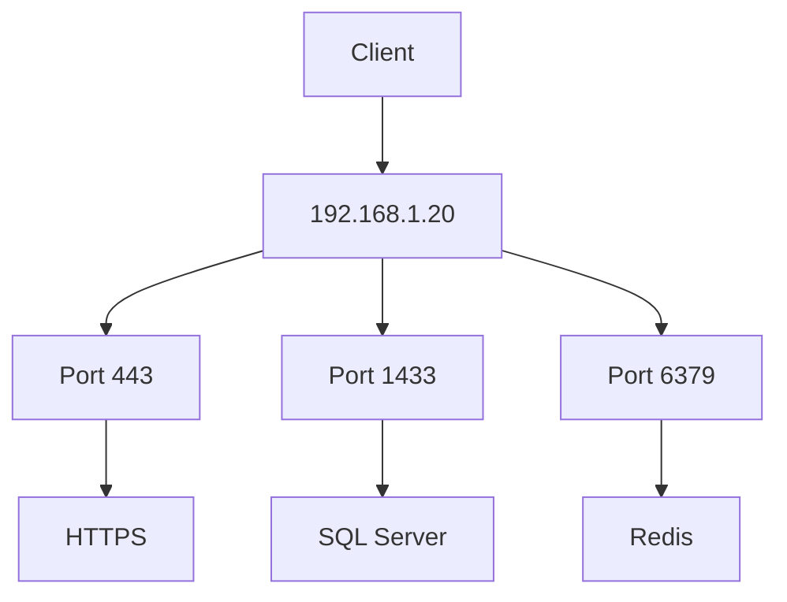
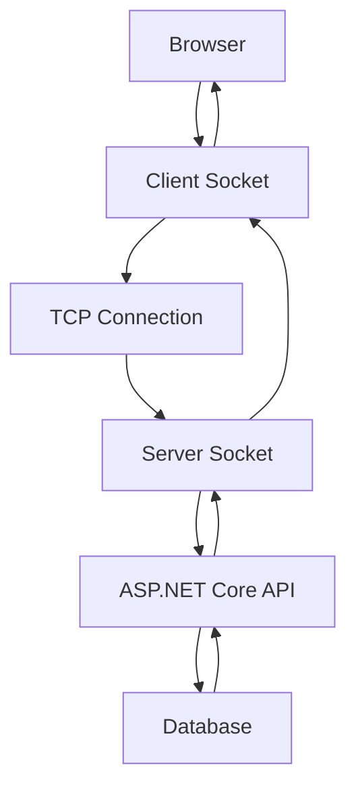

# 📘 Day 04 — Ports & Sockets (Lecture 3)

> **Module:** Foundation
>
> **Difficulty:** 🟡 Beginner
>
> **Estimated Time:** 60–75 Minutes
>
> **Prerequisites:**
>
> - Client-Server Architecture
> - Internet Fundamentals
> - DNS
> - TCP
> - UDP
> - TCP vs UDP

---

# 🎯 Learning Objectives

After completing this lesson, you will be able to:

- Explain why Ports are required.
- Understand the relationship between IP Address and Port Number.
- Explain how one computer runs multiple applications simultaneously.
- Understand how the Operating System routes incoming requests.
- Build the foundation for understanding Sockets.

---

# 📖 Introduction

In the previous lectures, we learned the complete journey of a request.

```
Browser

↓

DNS

↓

IP Address

↓

TCP Connection
```

But one important question still remains.

Suppose DNS returns the following IP Address.

```
142.250.xxx.xxx
```

The request successfully reaches Google's server.

Now think like an engineer.

Google runs many different services:

- Gmail
- Google Search
- Google Drive
- Google Photos
- YouTube
- Maps
- Meet

All these services may exist on the same physical machine or behind the same public IP.

Question:

> **How does the Operating System know which application should receive the request?**

The answer is:

**Ports.**

---

# 🤔 Why Are Ports Needed?

Imagine there were no Ports.

A request reaches your laptop.

```
192.168.1.20
```

Your laptop is running:

- Chrome
- SQL Server
- Redis
- Docker
- ASP.NET Core API

Now the Operating System receives a network request.

Question:

Which application should receive it?

- SQL Server?
- Chrome?
- Redis?
- ASP.NET API?

The Operating System cannot decide.

This problem is solved using **Port Numbers**.

---

# 🏢 Real-Life Analogy

Imagine a large apartment building.

```
ABC Residency

Sector 15

Noida
```

This is similar to an **IP Address**.

Now imagine the building contains:

```
Flat 101

Flat 102

Flat 103

Flat 104
```

These are similar to **Port Numbers**.

A courier needs:

```
Building Address

+

Flat Number
```

Similarly, a computer needs:

```
IP Address

+

Port Number
```

Without the flat number,

the courier cannot deliver the parcel.

Without the port number,

the Operating System cannot deliver the network request.

---

# 💡 What is a Port?

A **Port** is a logical communication endpoint used by the Operating System to identify a specific application or service running on a device.

### Simple Definition

> **IP Address identifies the machine.**
>
> **Port Number identifies the application.**

---

# 🌍 IP Address vs Port Number

Many beginners confuse these two concepts.

Let's compare them.

| IP Address | Port Number |
|------------|-------------|
| Identifies a Device | Identifies an Application |
| Network Address | Logical Communication Endpoint |
| Example: 192.168.1.20 | Example: 443 |
| One Device | Many Ports |

---

# 💻 Real-World Example

Suppose your laptop has the following applications running.

```
Chrome

SQL Server

Redis

Docker

ASP.NET Core API
```

All of them share the same IP Address.

```
192.168.1.20
```

But each application listens on a different port.

```
192.168.1.20:443

↓

Chrome / HTTPS

--------------------

192.168.1.20:1433

↓

SQL Server

--------------------

192.168.1.20:6379

↓

Redis

--------------------

192.168.1.20:5266

↓

ASP.NET Core API
```

Notice something interesting.

The **IP Address is the same**, but the **Port Number is different**.

This allows multiple applications to run simultaneously on one machine.

---

# ⚙️ How the Operating System Uses Ports

Whenever a request arrives, the Operating System checks:

```
Destination IP

+

Destination Port
```

Example:

```
192.168.1.20:5266
```

The Operating System immediately knows:

```
5266

↓

ASP.NET Core API
```

Similarly,

```
192.168.1.20:1433
```

means

```
SQL Server
```

The Port Number acts like an address inside the machine.

---

# 📊 Communication Flow

```
Browser

↓

192.168.1.20:5266

↓

Operating System

↓

ASP.NET Core API
```

Without Ports:

```
Browser

↓

192.168.1.20

↓

❌ Which application?
```

The Operating System would have no idea where to deliver the request.

---

# 🌍 Production Example

Suppose a company hosts both its website and its database on the same server.

```
Company Server

↓

203.0.113.10
```

Applications running:

```
HTTPS Website

↓

Port 443

---------------------

SQL Server

↓

Port 1433

---------------------

Redis

↓

Port 6379
```

All services use the same machine,

but different ports ensure requests reach the correct application.

---

# 📊 Architecture Diagram

### ASCII Diagram

```
                Client

                  │

                  ▼

        192.168.1.20

                  │

        ┌─────────┼─────────┐

        ▼         ▼         ▼

     443       1433      6379

      │          │          │

   Browser     SQL       Redis
```

### Mermaid Diagram



---

# 📌 Key Points

- A Port identifies an application running on a machine.
- An IP Address identifies the machine.
- Multiple applications can run on the same IP using different ports.
- The Operating System uses the destination Port Number to forward requests.
- Without Ports, application-level communication would not be possible.

---

# 🔜 Continue in Part 2

In Part 2, we will learn:

- Why Ports range from **0 to 65535**
- Well-Known Ports
- Registered Ports
- Dynamic (Ephemeral) Ports
- Common Port Numbers
- Why ASP.NET Core uses ports like **5266**
- Why two applications cannot use the same Port
- Engineering Trade-offs

---

# 🔢 Understanding Port Numbers

Every application that communicates over a network uses a **Port Number**.

A Port Number is a **16-bit unsigned integer**, which means it can represent:

```
2¹⁶ = 65,536 values
```

Since counting starts from **0**, the available port range is:

```
0 → 65535
```

Every network-enabled application listens on one of these ports.

---

# 🤔 Why Only 65535 Ports?

A Port Number is stored using **16 bits**.

```
16 Bits

↓

2¹⁶

↓

65,536 Values

↓

Ports 0 – 65535
```

This is why no port number can be greater than **65535**.

---

# 📚 Port Categories

The **Internet Assigned Numbers Authority (IANA)** divides ports into three categories.

```
0
│
├────────────1023────────────49151────────────65535
│                 │                         │
│                 │                         │
Well-Known     Registered           Dynamic / Ephemeral
Ports          Ports                Ports
```

Each category serves a different purpose.

---

# 1️⃣ Well-Known Ports (0–1023)

These ports are reserved for the most common Internet services.

Most operating systems and networking software expect these services to use their standard ports.

### Common Well-Known Ports

| Port | Service | Purpose |
|------|----------|---------|
| 20/21 | FTP | File Transfer |
| 22 | SSH | Secure Remote Login |
| 25 | SMTP | Sending Email |
| 53 | DNS | Domain Name Resolution |
| 80 | HTTP | Web Traffic |
| 110 | POP3 | Receive Email |
| 143 | IMAP | Email Synchronization |
| 443 | HTTPS | Secure Web Traffic |

---

## Example

When you open:

```
https://google.com
```

The browser automatically connects to:

```
google.com

↓

Port 443
```

Similarly,

```
http://example.com
```

connects to:

```
Port 80
```

unless another port is explicitly specified.

---

# 2️⃣ Registered Ports (1024–49151)

These ports are commonly used by applications, databases, and middleware.

Although they are not mandatory, developers usually follow these conventions.

### Common Registered Ports

| Port | Service |
|------|----------|
| 1433 | Microsoft SQL Server |
| 1521 | Oracle Database |
| 3306 | MySQL |
| 5432 | PostgreSQL |
| 5672 | RabbitMQ |
| 6379 | Redis |
| 8080 | Alternative HTTP |

---

## Production Example

Suppose your backend is built using ASP.NET Core.

```
ASP.NET Core API

↓

SQL Server

↓

Redis
```

Communication may look like this:

```
API

↓

SQL Server

↓

Port 1433

--------------------

API

↓

Redis

↓

Port 6379
```

Different services communicate through different ports.

---

# 3️⃣ Dynamic / Ephemeral Ports (49152–65535)

These ports are automatically assigned by the Operating System.

Applications use them temporarily while creating outgoing network connections.

Example:

```
Chrome

↓

Local Port 52341

↓

google.com:443
```

Next time,

Chrome may use

```
53182
```

or

```
54811
```

The Operating System automatically selects an available temporary port.

---

# 🌍 Why Does ASP.NET Core Run on Port 5266?

When we created our ASP.NET Core API,

it started like this:

```
http://localhost:5266
```

Question:

Why not Port 80?

The answer is simple.

During development,

Visual Studio or the .NET CLI automatically selects an available **dynamic port** to avoid conflicts with applications already using standard ports.

In production,

your application is usually hosted behind:

- IIS
- Nginx
- Apache

These servers often listen on:

```
80

or

443
```

and forward requests to your application running on an internal port.

---

# 💻 Real Development Example

Suppose you're developing on your laptop.

```
Chrome

↓

52341

--------------------

ASP.NET Core API

↓

5266

--------------------

SQL Server

↓

1433

--------------------

Redis

↓

6379
```

All applications share the same IP address,

but each one uses a different port.

---

# ❌ Why Can't Two Applications Use the Same Port?

Suppose SQL Server is already listening on:

```
192.168.1.20:1433
```

Now your ASP.NET Core application also tries to use:

```
192.168.1.20:1433
```

The Operating System immediately reports:

```
Address already in use
```

Why?

Because when a request arrives at:

```
192.168.1.20:1433
```

the OS cannot determine whether it should send the request to:

- SQL Server
- ASP.NET Core API

This creates ambiguity.

Therefore,

**only one application can listen on the same IP and Port combination at a time.**

---

# 📊 Architecture Example

```
                 192.168.1.20

          ┌─────────┼─────────┐
          ▼         ▼         ▼

      Port 443   Port 1433   Port 6379

          │          │          │

      HTTPS      SQL Server    Redis
```

---

# 🧠 Engineering Thinking

Imagine you're deploying a production application.

Your backend needs:

- SQL Server
- Redis
- RabbitMQ

Question:

Why don't these services conflict?

Because each service listens on a **different default port**.

```
SQL Server

↓

1433

--------------------

Redis

↓

6379

--------------------

RabbitMQ

↓

5672
```

This allows multiple services to run on the same machine without interfering with one another.

---

# 💡 Interview Tip

If an interviewer asks:

> **Why does SQL Server use Port 1433?**

A good answer is:

> **1433 is the default registered port for Microsoft SQL Server. Using a standard port simplifies configuration and communication between applications. However, administrators can change the port if required.**

Notice the important point:

**Default** does not mean **mandatory**.

---

# 📌 Key Points

- Ports range from **0 to 65535**.
- A Port Number is a 16-bit unsigned integer.
- Ports are divided into:
  - Well-Known
  - Registered
  - Dynamic
- Standard services use well-known ports.
- Databases commonly use registered ports.
- Temporary client connections use dynamic ports.
- Only one application can listen on the same IP + Port combination.

---

# 🔜 Continue in Part 3

In Part 3, we'll cover:

- What is a Socket?
- Socket = IP + Port + Protocol
- Client Socket & Server Socket
- Complete Browser → Server Communication Flow
- Port vs Socket
- Interview Questions (With Answers)
- Engineering Thinking
- Assignment
- Chapter Summary
- Glossary

---

# 🔜 Continue in Part 3

In this part, we'll cover:

- What is a Socket?
- Why Do We Need Sockets?
- Socket = IP + Port + Protocol
- Client Socket & Server Socket
- How Socket Communication Works
- Complete Browser → Server Communication Flow
- Port vs Socket
- Production Examples

---

# 📘 What is a Socket?

In the previous sections, we learned that:

- IP Address identifies a **device**.
- Port Number identifies an **application**.

But one important question still remains.

> **How does data actually move between two applications?**

The answer is:

**Sockets.**

A **Socket** is the communication endpoint through which two applications exchange data over a network.

Without sockets, applications cannot send or receive data.

---

# 💡 Simple Definition

> **A Socket is a communication endpoint that allows two applications to exchange data over a network.**

Unlike a Port, which only identifies an application,

a Socket is responsible for **actual communication**.

---

# 🤔 Why Do We Need Sockets?

Imagine your house.

```
House Address

↓

Your Home
```

Now someone wants to deliver a parcel.

Can they throw it through the wall?

❌ No.

They need a **door**.

Similarly,

```
IP Address

↓

Machine

Port Number

↓

Application

Socket

↓

Communication Door
```

Without a socket,

applications know **where** the destination is,

but they cannot actually communicate.

---

# 🌍 Real-Life Analogy

Imagine calling your friend.

```
Phone Number

↓

Friend's Mobile

↓

Call Connected

↓

Conversation Starts
```

The phone number identifies the person.

The active phone call is similar to a **Socket**.

Only after the connection is established can both people communicate.

Similarly,

Ports identify applications,

Sockets enable communication.

---

# 🧠 Socket = IP + Port + Protocol

A Socket is identified using three things:

```
IP Address

+

Port Number

+

Transport Protocol (TCP / UDP)

=

Socket
```

Example:

```
127.0.0.1

+

5266

+

TCP

↓

Socket
```

Another example:

```
192.168.1.20

+

1433

+

TCP

↓

SQL Server Socket
```

Notice that the **Protocol** is also part of the socket.

The same Port Number can behave differently depending on whether TCP or UDP is being used.

---

# 🏗 Client Socket & Server Socket

Every communication happens between two sockets.

```
Client Socket

↓

Internet

↓

Server Socket
```

Example:

```
Chrome

↓

Client Socket

↓

Google Server

↓

Server Socket
```

The browser creates a **Client Socket**.

The server creates a **Server Socket**.

Communication occurs between these two endpoints.

---

# ⚙️ How Socket Communication Works

Let's understand the process step by step.

---

## Step 1 — Server Creates a Socket

Suppose you start your ASP.NET Core API.

```
dotnet run
```

The application creates a **Server Socket**.

```
ASP.NET Core API

↓

Socket Created

↓

Listening on Port 5266
```

The application is now waiting for incoming connections.

---

## Step 2 — Client Creates a Socket

Now you open your browser.

```
http://localhost:5266
```

The browser creates a **Client Socket**.

```
Browser

↓

Client Socket
```

---

## Step 3 — Connection Established

Since HTTP uses TCP,

a TCP connection is established.

```
Client Socket

↓

TCP Connection

↓

Server Socket
```

Now both applications are connected.

---

## Step 4 — Data Transfer

The browser sends an HTTP request.

```
Browser

↓

Client Socket

↓

HTTP Request

↓

Server Socket

↓

ASP.NET Core API
```

The API processes the request and generates a response.

```
ASP.NET Core API

↓

Server Socket

↓

HTTP Response

↓

Client Socket

↓

Browser
```

---

## Step 5 — Connection Closed

Once communication is complete,

the socket is closed.

```
Request Completed

↓

Socket Closed
```

For HTTP/1.1, the connection may remain open briefly depending on Keep-Alive settings.

---

# 🌍 Complete Browser → Server Communication Flow

Let's connect everything you've learned so far.

```
User

↓

Browser

↓

DNS Lookup

↓

IP Address Found

↓

TCP Connection

↓

Destination Port

↓

Client Socket

↓

Internet

↓

Server Socket

↓

Operating System

↓

ASP.NET Core API

↓

Business Logic

↓

Database

↓

Response

↓

Server Socket

↓

Client Socket

↓

Browser

↓

User
```

This is the complete communication flow behind a typical web request.

---

# 📊 Port vs Socket

| Port | Socket |
|------|--------|
| Identifies an application | Communication endpoint |
| Logical number | Combination of IP + Port + Protocol |
| Used by the Operating System | Used by applications |
| Cannot transfer data | Sends and receives data |
| Example: 443 | Example: 142.250.xxx.xxx:443 (TCP) |

---

# 🌍 Production Example

Suppose your production server hosts multiple services.

```
Server

↓

Nginx

↓

443

--------------------

ASP.NET Core API

↓

5000

--------------------

SQL Server

↓

1433

--------------------

Redis

↓

6379
```

When a browser opens:

```
https://example.com
```

The communication flow is:

```
Browser

↓

TCP Connection

↓

Port 443

↓

Nginx

↓

Forward Request

↓

ASP.NET Core API

↓

SQL Server

↓

Response

↓

Browser
```

This is a simplified version of how many production systems handle requests.

---

# 📊 Architecture Diagram

### ASCII Diagram

```
Browser

↓

Client Socket

↓

TCP

↓

Server Socket

↓

ASP.NET Core API

↓

Database

↓

Response

↓

Browser
```

### Mermaid Diagram



---

# 📌 Key Takeaways

- A Socket is the communication endpoint between two applications.
- A Socket is identified by **IP Address + Port Number + Protocol**.
- Communication always occurs between a **Client Socket** and a **Server Socket**.
- Ports identify applications, while Sockets enable communication.
- Every HTTP request involves sockets behind the scenes.

---

# 🔜 Continue in Part 3B

In Part 3B, we'll cover:

- 💼 Beginner Interview Questions (With Answers)
- 🟡 Intermediate Interview Questions
- 🔴 Advanced Interview Questions
- 🎯 Scenario-Based Questions
- 🧠 Think Like an Engineer
- 🧪 Practical Lab
- ❌ Common Mistakes
- 📝 Assignment
- 📚 Chapter Summary
- 📖 Revision Cheat Sheet
- 📖 Glossary
- 🔗 Related Topics

---

# 💼 Interview Questions (With Answers)

## 🟢 Beginner Level

### Q1. What is a Port?

**Answer:**

A **Port** is a logical communication endpoint used by the Operating System to identify a specific application or service running on a device.

Simply:

> **IP Address identifies the device, while a Port Number identifies the application.**

---

### Q2. What is a Socket?

**Answer:**

A **Socket** is a communication endpoint that enables two applications to exchange data over a network.

A Socket is identified by:

```
IP Address
+
Port Number
+
Protocol (TCP/UDP)
```

---

### Q3. What is the difference between an IP Address and a Port?

**Answer:**

| IP Address | Port |
|------------|------|
| Identifies a device | Identifies an application |
| One per network interface | Thousands can exist on one device |
| Example: 192.168.1.20 | Example: 443 |

---

### Q4. What is the difference between a Port and a Socket?

**Answer:**

| Port | Socket |
|------|--------|
| Identifies an application | Communication endpoint |
| Logical number | IP + Port + Protocol |
| Used by the Operating System | Used by applications |
| Cannot transfer data | Sends and receives data |

---

### Q5. Why do we need Ports?

**Answer:**

A single computer can run multiple applications simultaneously.

Ports help the Operating System determine which application should receive an incoming network request.

---

### Q6. Why do we need Sockets?

**Answer:**

Ports only identify an application.

Sockets actually allow two applications to communicate and exchange data over a network.

---

# 🟡 Intermediate Level

### Q7. Why are there only 65535 Ports?

**Answer:**

Port Numbers are stored using **16 bits**.

```
2^16

↓

65536 Values

↓

Ports 0–65535
```

---

### Q8. Why can't two applications use the same Port?

**Answer:**

If two applications listen on the same IP and Port,

the Operating System cannot determine which application should receive incoming packets.

Therefore,

only one application can listen on a specific **IP + Port** combination.

---

### Q9. Why does ASP.NET Core usually run on ports like 5266?

**Answer:**

During development,

Visual Studio or the .NET CLI automatically assigns an available dynamic port to avoid conflicts with applications already using standard ports.

---

### Q10. Why does HTTPS use Port 443?

**Answer:**

Port **443** is the standard well-known port assigned for HTTPS communication.

Browsers automatically connect to Port 443 unless another port is explicitly specified.

---

### Q11. Why does SQL Server use Port 1433?

**Answer:**

1433 is the default registered port assigned for Microsoft SQL Server.

It is a convention, not a mandatory requirement.

Administrators can configure another port if required.

---

### Q12. Which category does Redis Port 6379 belong to?

**Answer:**

Redis uses **Registered Port 6379**.

---

# 🔴 Advanced Level

### Q13. What is a Listening Socket?

**Answer:**

A Listening Socket is a server socket that waits for incoming client connection requests.

Example:

```
ASP.NET Core API

↓

Listening on Port 5266
```

---

### Q14. Difference between Client Socket and Server Socket?

| Client Socket | Server Socket |
|---------------|---------------|
| Initiates communication | Waits for requests |
| Created by Browser/Postman | Created by Server |
| Sends Requests | Sends Responses |

---

### Q15. Can HTTPS run on Port 8443?

**Answer:**

Yes.

Port **443** is the default standard.

HTTPS can run on any available port if configured.

Example:

```
https://localhost:8443
```

---

### Q16. Can SQL Server run on Port 1500 instead of 1433?

**Answer:**

Yes.

1433 is only the default.

The port can be changed by configuration.

---

### Q17. Can two different applications use Port 80?

**Answer:**

Not on the same **IP Address** at the same time.

Only one application can listen on a particular IP + Port combination.

---

# 🎯 Scenario-Based Questions

## Scenario 1

Your ASP.NET Core application throws:

```
Address already in use
```

### Why?

Another application is already listening on the same IP and Port.

---

## Scenario 2

A user opens:

```
https://amazon.in
```

Explain the communication flow.

### Answer

```
Browser

↓

DNS

↓

IP Address

↓

TCP Connection

↓

Port 443

↓

Client Socket

↓

Internet

↓

Server Socket

↓

Operating System

↓

Backend

↓

Database

↓

Response

↓

Browser
```

---

## Scenario 3

Your production server hosts:

- SQL Server
- Redis
- ASP.NET Core API

Why don't they conflict?

### Answer

Each application uses a different Port Number.

```
SQL Server → 1433

Redis → 6379

ASP.NET → 5000
```

---

## Scenario 4

A junior developer asks:

> "If IP already identifies the machine, why do we need Ports?"

### Answer

IP identifies **which device**.

Port identifies **which application**.

Both are required.

---

## Scenario 5

Your browser opens Google.

Who creates the Client Socket?

### Answer

The Browser creates the Client Socket.

Google creates the Server Socket.

Communication occurs between these two sockets.

---

## Scenario 6

Your application cannot connect to SQL Server.

What should you check?

### Answer

- Is SQL Server running?
- Is Port 1433 open?
- Is Firewall blocking the Port?
- Is SQL Server listening on the configured Port?

---

# 🧠 Think Like an Engineer

Don't ask:

> "What is a Port?"

Ask:

> **How does the Operating System know which process should receive an incoming network packet?**

---

Don't ask:

> "What is a Socket?"

Ask:

> **How do two applications exchange data over a network?**

---

Don't ask:

> "Why Port 443?"

Ask:

> **Why did networking standards define Port 443 for HTTPS?**

Engineering is about understanding **why**, not just **what**.

---

# 🌍 Production Example

A typical production server may look like this:

```
Internet

↓

Nginx

↓

443

↓

ASP.NET Core API

↓

5000

↓

SQL Server

↓

1433

↓

Redis

↓

6379
```

Each service listens on a different Port and communicates through Sockets.

---

# 🧪 Practical Lab

## Lab 1 — View Listening Ports

```bash
ss -tuln
```

Observe all listening TCP and UDP ports.

---

## Lab 2 — Find Process Using a Port

```bash
lsof -i
```

Find which application owns each Port.

---

## Lab 3 — Verify Your ASP.NET API

Run:

```bash
dotnet run
```

Open:

```
http://localhost:5266
```

Verify that your application is listening on Port **5266**.

---

## Lab 4 — Observe SQL Server

Run:

```bash
ss -tuln | grep 1433
```

Verify SQL Server is listening on Port **1433**.

---

# ❌ Common Mistakes

### Mistake 1

Thinking IP Address identifies an application.

✅ Reality:

IP identifies the device.

---

### Mistake 2

Thinking Port and Socket are the same.

✅ Reality:

A Port identifies an application.

A Socket enables communication.

---

### Mistake 3

Thinking Port 443 is mandatory.

✅ Reality:

443 is the default standard.

Applications can use another port if configured.

---

### Mistake 4

Thinking a Socket is only IP + Port.

✅ Reality:

A Socket is identified by:

```
IP Address

+

Port Number

+

Protocol
```

---

# 📝 Assignment

### Question 1

Explain IP Address, Port and Socket using one real-life analogy.

---

### Question 2

Explain the complete Browser → Server communication flow.

---

### Question 3

Why can't two applications use the same Port?

---

### Question 4

Why does ASP.NET Core use dynamic Ports during development?

---

### Question 5

Differentiate:

- Well-Known Ports
- Registered Ports
- Dynamic Ports

with examples.

---

# 📚 Chapter Summary

```
IP Address

↓

Device

↓

Port Number

↓

Application

↓

Socket

↓

Communication

↓

Browser ↔ Server

↓

Response
```

---

# 📖 Revision Cheat Sheet

```
IP

↓

Machine

-------------------

Port

↓

Application

-------------------

Socket

↓

IP + Port + Protocol

-------------------

Well-Known

↓

0–1023

-------------------

Registered

↓

1024–49151

-------------------

Dynamic

↓

49152–65535
```

---

# 📖 Glossary

| Term | Meaning |
|------|---------|
| IP Address | Identifies a device |
| Port | Identifies an application |
| Socket | Communication endpoint |
| Well-Known Port | Standard service port |
| Registered Port | Common application port |
| Dynamic Port | Temporary OS-assigned port |
| Listening Socket | Socket waiting for incoming connections |

---

# 🔗 Related Topics

## Previous

- Client-Server Architecture
- DNS
- TCP
- UDP
- TCP vs UDP

## Next

- TCP Three-Way Handshake
- HTTP
- HTTPS
- REST APIs
