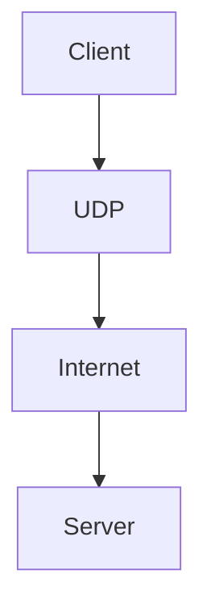
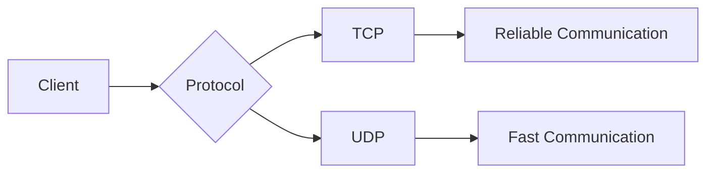

# 📘 Day 04 — TCP & Reliable Communication (Lecture 1)

> **Module:** Foundation
>
> **Difficulty:** 🟡 Beginner
>
> **Estimated Time:** 45–60 Minutes
>
> **Prerequisites:**
>
> - Internet Fundamentals
> - DNS (Domain Name System)
> - Client-Server Architecture

---

# 🎯 Learning Objectives

After completing this lesson, you will be able to:

- Explain why TCP was created.
- Understand the problems without TCP.
- Define TCP.
- Explain why TCP is called a Connection-Oriented protocol.
- Identify applications where TCP is used.
- Build the foundation for TCP Three-Way Handshake.

---

# 📖 Introduction

In the previous lesson, we learned how **DNS (Domain Name System)** converts a **Domain Name** into an **IP Address**.

Example:

```
google.com
      │
      ▼
142.250.xxx.xxx
```

At this stage, the browser knows the IP address of Google's server.

But a question arises.

> **Can the browser immediately start sending data?**

The answer is **No**.

Before sending any data, the client and server must establish a **reliable communication channel**.

This responsibility is handled by **TCP (Transmission Control Protocol).**

Without TCP, important Internet applications such as online banking, e-commerce, cloud storage, and email would not work reliably.

---

# 🤔 Why Do We Need TCP?

Imagine you are sending an important message to your friend.

```
Hello, How are you?
```

Now imagine there is **no protocol** to manage communication.

Several problems may occur during transmission.

---

# ❌ Problem 1 – Packet Loss

Some packets may never reach the destination.

Example:

Original Message

```
Hello,
How
are
you?
```

Received Message

```
Hello,
are
you?
```

The packet containing **"How"** was lost.

The receiver receives incomplete information.

---

# ❌ Problem 2 – Wrong Packet Order

Suppose every packet reaches the destination.

However, they arrive in a different order.

```
you?

Hello,

How

are
```

The complete message exists,

but the order is incorrect.

Incorrect ordering may completely change the meaning of data.

---

# ❌ Problem 3 – Duplicate Packets

Sometimes the same packet arrives multiple times.

Example

```
Hello

Hello

How are you?
```

Duplicate packets create incorrect results.

Imagine a banking transaction being processed twice.

The consequences could be serious.

---

# ❌ Problem 4 – No Delivery Confirmation

The sender has no idea:

- Did the receiver receive the data?
- Was any packet lost?
- Should the sender send the data again?

Without confirmation,

communication cannot be trusted.

---

# 💡 Why These Problems Matter

Consider these applications:

- Online Banking
- UPI Payments
- Amazon Orders
- Email
- Cloud File Upload

Can these applications ignore lost packets?

**Absolutely not.**

Even one missing packet can result in:

- Failed payment
- Corrupted file
- Incomplete email
- Incorrect database record

These applications require **100% reliable communication**.

---

# 💡 The Solution

TCP was designed to solve these problems.

TCP provides:

- Reliable Communication
- Ordered Delivery
- Error Detection
- Retransmission
- Acknowledgement (ACK)

Instead of simply sending data,

TCP continuously checks whether every packet has been successfully delivered.

---

# 🧠 What is TCP?

**TCP (Transmission Control Protocol)** is a **Connection-Oriented Transport Layer Protocol** that provides reliable, ordered, and error-checked communication between two devices.

### Simple Definition

> TCP ensures that data reaches the destination completely, correctly, and in the correct order.

---

# 📦 Responsibilities of TCP

TCP performs several important tasks.

- Establishes a connection.
- Divides data into segments.
- Numbers every segment.
- Detects lost segments.
- Retransmits missing segments.
- Delivers data in the correct order.
- Confirms successful delivery.
- Safely closes the connection.

Without TCP,

applications would have to implement all these responsibilities themselves.

---

# 🌍 Real-Life Analogy

Imagine sending important documents through a courier company.

The courier service:

- Accepts the parcel.
- Generates a tracking ID.
- Tracks the parcel during transportation.
- Confirms delivery.
- Re-delivers if the parcel is lost.

TCP behaves in a similar way.

Instead of parcels,

TCP manages data packets.

---

# 🏢 Production Example

Suppose you transfer:

```
₹10,00,000
```

from one bank account to another.

Question:

Can the bank ignore a missing packet?

**No.**

The bank must ensure:

- Every packet reaches the destination.
- Packets arrive in the correct order.
- No packet is duplicated.
- The sender receives confirmation.

This is one of the reasons banking systems use **TCP**.

---

# 📊 High-Level Communication Flow

```
Browser
      │
      ▼
DNS Resolution
      │
      ▼
IP Address Found
      │
      ▼
TCP Connection
      │
      ▼
Reliable Data Transfer
      │
      ▼
Server
```

Notice that **TCP starts only after DNS has successfully returned the IP Address.**

---

# 📌 Key Points

- TCP stands for **Transmission Control Protocol**.
- TCP works at the **Transport Layer**.
- TCP is a **Connection-Oriented Protocol**.
- TCP focuses on **Reliability**, not maximum speed.
- TCP ensures data reaches the destination correctly and in order.

---

# 🔜 Continue in Part 2

In Part 2, we will study:

- What is Connection-Oriented Communication?
- Internal Working of TCP
- Advantages of TCP
- Limitations of TCP
- Real Production Examples
- Architecture Diagrams
- Interview Tips

---

# 🔗 Connection-Oriented Communication

TCP is called a **Connection-Oriented Protocol** because it establishes a connection between the client and the server **before** any data is transferred.

Unlike protocols that immediately send data, TCP first ensures that both sides are ready to communicate.

> **Rule:** No Connection → No Data Transfer

---

# 🤔 Why is Connection Establishment Important?

Imagine you call your friend.

You don't start speaking immediately.

Instead, the conversation happens like this:

```
You: Hello!

↓

Friend: Hello!

↓

You: Can we talk?

↓

Friend: Yes.

↓

Conversation Starts
```

The same concept is followed by TCP.

Before data transfer begins, both the client and the server agree to communicate.

This process is called **Connection Establishment**.

> **Note:** The actual connection establishment process (Three-Way Handshake) will be covered in the next lecture.

---

# ⚙️ High-Level Working of TCP

The communication process can be divided into three phases.

## Phase 1 — Connection Establishment

The client requests a connection.

The server accepts the request.

Once both sides are ready, communication begins.

```
Client

↓

Connection Request

↓

Server

↓

Connection Accepted
```

---

## Phase 2 — Reliable Data Transfer

After the connection is established:

- Data is divided into segments.
- Each segment is numbered.
- The receiver acknowledges every segment.
- Lost segments are retransmitted.
- Segments are reassembled in the correct order.

```
Client

↓

Segment 1

↓

Segment 2

↓

Segment 3

↓

Server

↓

ACK
```

---

## Phase 3 — Connection Termination

After all data has been successfully transferred,

TCP safely closes the connection.

```
Client

↓

Close Connection

↓

Server

↓

Connection Closed
```

This prevents unnecessary network resource usage.

---

# 🏗️ Internal Working of TCP (High-Level)

```
Application

↓

TCP

↓

Segments

↓

IP

↓

Network

↓

Destination

↓

TCP

↓

Application
```

### Explanation

- The application generates data.
- TCP divides the data into smaller segments.
- IP delivers those segments through the network.
- The destination TCP layer reassembles them in the correct order.
- Finally, the complete data is delivered to the destination application.

---

# 🌍 Real-World Example

Imagine uploading a project report to Google Drive.

Steps:

```
Choose File

↓

TCP Connection Established

↓

File Split into Segments

↓

Segments Sent

↓

Google Receives Segments

↓

Acknowledgement Sent

↓

Upload Completed
```

If one segment is lost,

TCP retransmits only the missing segment instead of sending the entire file again.

---

# 🏦 Production Example – Online Banking

Suppose you transfer **₹5,00,000** using Internet Banking.

During the transaction:

```
Client

↓

Transfer Request

↓

Packet 1

↓

Packet 2

↓

Packet 3 (Lost)

↓

Packet 4

↓

Server
```

Without TCP:

- Packet 3 is missing.
- The transaction becomes incomplete.

With TCP:

```
Packet 3 Lost

↓

Server detects missing packet

↓

ACK not received

↓

Packet 3 Retransmitted

↓

Transaction Completed Successfully
```

This is why banking systems rely on TCP.

---

# 🌐 Applications That Use TCP

TCP is preferred whenever **accuracy is more important than speed.**

Examples:

- 🌐 HTTP / HTTPS
- 🏦 Online Banking
- 🛒 E-Commerce
- 📧 Email
- ☁️ Google Drive
- 📁 FTP / SFTP
- 💳 Payment Gateways
- 🗄️ Database Communication

---

# ✅ Advantages of TCP

### 1. Reliable Communication

Ensures that all data reaches the destination.

---

### 2. Ordered Delivery

Data is delivered in the same order in which it was sent.

---

### 3. Error Detection

Detects corrupted or missing packets.

---

### 4. Retransmission

Automatically retransmits lost packets.

---

### 5. Flow Control

Prevents a fast sender from overwhelming a slow receiver.

*(We'll study Flow Control in detail later.)*

---

### 6. Congestion Control

Helps prevent excessive network traffic.

*(Detailed explanation in a later lecture.)*

---

# ⚠️ Limitations of TCP

Although TCP is extremely reliable,

it also has some trade-offs.

## 1. Slower Than UDP

Because TCP performs:

- Connection establishment
- Acknowledgements
- Retransmissions
- Error checking

it introduces additional overhead.

---

## 2. Higher Latency

Waiting for acknowledgements increases communication time.

---

## 3. More Network Overhead

TCP exchanges additional control packets before and during communication.

---

# 📊 TCP Communication Lifecycle

```
Client
   │
   ▼
Connection Request
   │
   ▼
Connection Established
   │
   ▼
Reliable Data Transfer
   │
   ▼
Acknowledgements
   │
   ▼
Connection Closed
```

---

# 💡 Interview Tip

A common misconception is:

> **"TCP is better than UDP."**

This statement is **incorrect**.

The correct statement is:

> **TCP is better when reliability is more important than speed.**

For applications where **low latency** is more important than **perfect reliability**, other transport protocols may be a better choice.

---

# 🧠 Think Like an Engineer

Suppose you are designing two applications:

### Application 1

Online Banking

Requirements:

- No packet loss
- Correct order
- Delivery confirmation

Which protocol would you choose?

---

### Application 2

Live Video Streaming

Requirements:

- Smooth playback
- Very low latency

Would waiting for every lost packet improve or worsen the user experience?

Think about this before learning UDP in the next lecture.

---

# 🔜 Continue in Part 3

In Part 3, we'll complete this chapter with:

- 💼 Interview Questions (with answers)
- 🎯 Scenario-Based Questions
- ❌ Common Mistakes
- 📝 Assignment
- 📚 Summary
- 📖 Glossary
- 💼 LinkedIn Post
- 🎨 Infographic Prompt

---

# 💼 Interview Questions (With Answers)

## Beginner Level

### Q1. What is TCP?

**Answer:**

TCP (Transmission Control Protocol) is a **connection-oriented transport layer protocol** that provides reliable, ordered, and error-checked communication between two devices.

It ensures that data reaches the destination:

- Completely
- Correctly
- In the correct order

---

### Q2. Why do we need TCP?

**Answer:**

Without TCP, communication may suffer from:

- Packet Loss
- Wrong Packet Order
- Duplicate Packets
- No Delivery Confirmation

TCP solves these problems by providing:

- Reliable Communication
- Ordered Delivery
- Retransmission
- Acknowledgement (ACK)

---

### Q3. Why is TCP called a Connection-Oriented Protocol?

**Answer:**

TCP establishes a connection between the client and the server before transferring data.

Only after a successful connection does communication begin.

This makes TCP a **Connection-Oriented Protocol**.

---

### Q4. At which layer does TCP work?

**Answer:**

TCP works at the **Transport Layer (Layer 4)** of the OSI Model.

---

### Q5. Name some applications that use TCP.

**Answer:**

- HTTP
- HTTPS
- Email
- FTP
- Banking Applications
- Payment Gateways
- Cloud Storage

---

# 🚀 Intermediate Level Questions

## Q6. Why is TCP preferred over unreliable communication?

**Answer:**

Many applications require accurate and complete data.

For example:

- Online Banking
- E-Commerce
- File Upload
- Email

Even one missing packet can lead to incorrect results.

TCP ensures reliable communication.

---

## Q7. Why can't HTTP provide reliability by itself?

**Answer:**

HTTP is an **Application Layer Protocol**.

It focuses on request-response communication.

Reliability such as:

- Packet Ordering
- Retransmission
- Error Detection
- Acknowledgement

is provided by TCP.

Therefore,

HTTP depends on TCP.

---

## Q8. Why is TCP slower than UDP?

**Answer:**

TCP performs additional operations such as:

- Connection Establishment
- Acknowledgement
- Error Checking
- Retransmission
- Ordered Delivery

These operations increase reliability but also introduce additional overhead.

---

# 🧠 Scenario-Based Questions

---

## Scenario 1

You are building an Online Banking Application.

Which protocol would you choose?

**Answer**

TCP.

Reason:

Money transfer requires:

- No Packet Loss
- Ordered Delivery
- Delivery Confirmation
- Reliable Communication

---

## Scenario 2

Suppose Packet 25 is lost during communication.

What should happen?

**Answer**

TCP detects the missing packet.

The receiver does not acknowledge Packet 25.

The sender retransmits Packet 25.

Only after successful delivery does communication continue.

---

## Scenario 3

You are uploading a 2 GB file.

One packet is lost.

Should the entire file be uploaded again?

**Answer**

No.

TCP retransmits only the missing packet instead of sending the complete file again.

This improves efficiency.

---

# 🎯 Think Like an Engineer

Suppose you are designing two applications.

---

## Application A

Online Banking

Requirements:

- Reliable
- Secure
- No Packet Loss

Which protocol would you choose?

**Answer**

TCP.

---

## Application B

Video Streaming

Requirements:

- Low Latency
- Continuous Playback

Would waiting for every lost packet improve the user experience?

Think about it.

We'll answer this in the next lecture while studying UDP.

---

# ❌ Common Mistakes

### Mistake 1

Thinking TCP is the fastest protocol.

✅ Reality:

TCP prioritizes reliability over speed.

---

### Mistake 2

Thinking HTTP provides reliability.

✅ Reality:

Reliability is provided by TCP.

HTTP depends on TCP.

---

### Mistake 3

Thinking every application should use TCP.

✅ Reality:

Different applications have different requirements.

Some applications prioritize speed over reliability.

---

### Mistake 4

Thinking TCP guarantees instant communication.

✅ Reality:

TCP guarantees reliable communication, not the fastest communication.

---

# 📝 Assignment

## Question 1

Explain TCP in your own words.

---

## Question 2

Write four problems that occur without TCP.

---

## Question 3

Why is TCP called a Connection-Oriented Protocol?

---

## Question 4

Explain why TCP is used in Banking Applications.

---

## Question 5

List five real-world applications that use TCP.

---

# 📚 Chapter Summary

```
Browser

↓

DNS Resolution

↓

IP Address Found

↓

TCP Connection Established

↓

Reliable Data Transfer

↓

Acknowledgement

↓

Connection Closed
```

### Key Learnings

- TCP stands for Transmission Control Protocol.
- TCP works at the Transport Layer.
- TCP is Connection-Oriented.
- TCP provides Reliable Communication.
- TCP ensures Ordered Delivery.
- TCP retransmits Lost Packets.
- TCP provides Acknowledgements.
- TCP is used where data accuracy is critical.

---

# 📖 Glossary

| Term | Meaning |
|------|---------|
| TCP | Transmission Control Protocol |
| Reliable Communication | Data reaches correctly and completely |
| ACK | Acknowledgement sent by the receiver |
| Retransmission | Sending a lost packet again |
| Connection-Oriented | Connection established before communication |
| Segment | Small unit of data handled by TCP |
| Packet Loss | Failure of a packet to reach the destination |

---

# 📌 Revision Cheat Sheet

```
Problem
↓

Packet Loss
Wrong Order
Duplicate Packet
No Confirmation

↓

TCP

↓

Reliable Communication
Ordered Delivery
ACK
Retransmission

↓

Applications

Banking
HTTP/HTTPS
Email
FTP
Cloud Storage
```

---

# 🚀 Next Lecture

## 📘 Day 04 – Lecture 2

Topics:

- What is UDP?
- Why UDP was created?
- TCP vs UDP
- Real-World Examples
- Where TCP is Used
- Where UDP is Used
- Engineering Trade-offs

---

# 💼 LinkedIn Post

## 📚 Day 04 – TCP & Reliable Communication

Today I explored one of the most important networking protocols: **TCP (Transmission Control Protocol).**

Before any important data is transferred over the Internet, TCP ensures that communication is reliable.

Without TCP, communication may suffer from:

- ❌ Packet Loss
- ❌ Wrong Packet Order
- ❌ Duplicate Packets
- ❌ No Delivery Confirmation

TCP solves these challenges by providing:

- ✅ Reliable Communication
- ✅ Ordered Delivery
- ✅ Retransmission
- ✅ Error Detection
- ✅ Acknowledgement (ACK)

This is why applications such as online banking, e-commerce, email, cloud storage, and web browsing rely on TCP.

One key takeaway:

> **Good software engineering is not just about sending data quickly—it is about ensuring the right data reaches the right place reliably.**

Building my System Design fundamentals one concept at a time.

#SystemDesign #Networking #TCP #BackendDevelopment #DotNet #SoftwareEngineering #LearningInPublic

# 📘 Day 04 — UDP & TCP vs UDP (Lecture 2)

> **Module:** Foundation
>
> **Difficulty:** 🟡 Beginner
>
> **Estimated Time:** 45–60 Minutes
>
> **Prerequisites:**
>
> - Client-Server Architecture
> - Internet Fundamentals
> - DNS
> - Introduction to TCP

---

# 🎯 Learning Objectives

After completing this lesson, you will be able to:

- Explain why UDP was created.
- Understand the limitations of using TCP everywhere.
- Define UDP.
- Understand Connectionless Communication.
- Explain the difference between Connection-Oriented and Connectionless communication.
- Build the foundation for comparing TCP and UDP.

---

# 📖 Introduction

In the previous lecture, we learned that **TCP (Transmission Control Protocol)** provides reliable communication.

TCP ensures:

- Reliable Delivery
- Ordered Packets
- Error Detection
- Retransmission
- Acknowledgement (ACK)

These features make TCP an excellent choice for applications like:

- Online Banking
- E-Commerce
- Email
- Cloud Storage
- File Transfer

However, not every application requires perfect reliability.

Some applications need something more important:

- Faster Communication
- Lower Latency
- Real-Time Data Transfer

This is why **UDP (User Datagram Protocol)** was introduced.

---

# 🤔 Why Was UDP Created?

Let's understand this with a real-world problem.

Imagine you are watching a live IPL match.

Suddenly,

one video frame is lost during transmission.

Now there are two possibilities.

---

## Option 1 — TCP Behaviour

TCP detects the missing packet.

```
Frame Lost

↓

Wait

↓

Request Missing Packet

↓

Receive Packet

↓

Continue Playing
```

Result:

```
▶ Playing

⏸ Buffering

⏸ Waiting

▶ Continue
```

Although the video is accurate,

the viewing experience becomes poor due to buffering.

---

## Option 2 — UDP Behaviour

UDP simply ignores the missing packet.

```
Frame Lost

↓

Ignore

↓

Continue Streaming
```

Result:

```
▶▶▶▶▶▶▶▶
```

The user may miss one frame,

but the video continues smoothly.

This provides a much better real-time experience.

---

# 💡 Why Not Use TCP Everywhere?

Many beginners think:

> "TCP is reliable, so every application should use TCP."

This is **not true.**

TCP performs several additional tasks:

- Connection Establishment
- Packet Ordering
- Error Detection
- Retransmission
- Acknowledgements

These operations improve reliability,

but they also increase:

- Latency
- Processing Time
- Network Overhead

For applications where **speed is more important than perfect accuracy**,

TCP becomes inefficient.

---

# 🌍 Real-World Scenario

Imagine you are in a Zoom meeting.

Your friend says:

```
Hello, can you hear me?
```

One audio packet is lost.

TCP will say:

```
Stop.

↓

Resend Missing Packet.

↓

Continue.
```

The conversation becomes:

```
Hello...

(wait)

Can...

(wait)

You...

(wait)

Hear me?
```

This feels unnatural.

Now imagine UDP.

```
Packet Lost

↓

Ignore

↓

Continue
```

The listener may miss one small audio sample,

but the conversation remains smooth.

For real-time communication,

this is a much better experience.

---

# 🧠 What is UDP?

**UDP (User Datagram Protocol)** is a **Connectionless Transport Layer Protocol** that provides **fast communication with minimal overhead.**

Unlike TCP,

UDP **does not guarantee:**

- Reliable Delivery
- Ordered Packets
- Retransmission
- Delivery Confirmation (ACK)

### Simple Definition

> UDP prioritizes **speed and low latency** over guaranteed delivery.

---

# 📦 Responsibilities of UDP

UDP has very few responsibilities.

It simply:

- Accepts data from the application.
- Adds a UDP Header.
- Sends the data to the destination.

Unlike TCP,

UDP does **not**:

- Establish a connection.
- Track packets.
- Retransmit lost packets.
- Confirm delivery.
- Maintain packet order.

Because UDP performs fewer operations,

it is much faster.

---

# 🔗 Connectionless Communication

UDP is called a **Connectionless Protocol**.

This means:

Data can be sent immediately without first establishing a connection.

### Communication Flow

```
Client
   │
Send Data
   │
   ▼
Server
```

No handshake.

No waiting.

No acknowledgement.

Communication starts instantly.

---

# 🌍 Real-Life Analogy

Imagine a radio station broadcasting live music.

The radio station continuously sends audio signals.

It does **not** ask every listener:

```
Did you hear this sentence?

↓

Should I repeat it?
```

It simply continues broadcasting.

If someone misses one second of audio,

the broadcast does not stop.

UDP behaves in the same way.

---

# ⚙️ High-Level Working of UDP

```
Application

↓

UDP

↓

Network

↓

Destination

↓

Application
```

Unlike TCP,

UDP performs very little processing.

This makes communication extremely fast.

---

# 📊 Architecture Diagram

### ASCII Diagram

```
Client
   │
   ▼
UDP
   │
   ▼
Internet
   │
   ▼
Server
```

### Mermaid Diagram



---

# 📌 Key Points

- UDP stands for **User Datagram Protocol**.
- UDP works at the **Transport Layer**.
- UDP is **Connectionless**.
- UDP focuses on **Speed and Low Latency**.
- UDP does not guarantee delivery.
- UDP does not retransmit lost packets.
- UDP does not provide acknowledgements.

---

# 🔜 Continue in Part 2

In Part 2, we will study:

- TCP vs UDP (Detailed Comparison)
- Internal Working
- Production Examples
- Advantages
- Disadvantages
- Architecture Comparison
- Engineering Trade-offs

---

# ⚙️ Internal Working of UDP

Unlike TCP, UDP performs very little processing before sending data.

The communication process is very simple.

## Step 1 — Application Generates Data

Suppose you are on a WhatsApp voice call.

You speak:

```
Hello, How are you?
```

The voice data is generated by the application.

---

## Step 2 — UDP Adds a Header

UDP adds a very small header to the data.

The UDP header mainly contains:

- Source Port
- Destination Port
- Length
- Checksum

Unlike TCP, UDP does **not** add:

- Sequence Numbers
- ACK Numbers
- Window Size
- Connection Information

Because the header is much smaller, UDP processing is faster.

---

## Step 3 — Data is Sent Immediately

UDP immediately sends the packet to the destination.

```
Application

↓

UDP

↓

Internet

↓

Destination
```

No connection is established.

No acknowledgement is expected.

No waiting occurs.

---

## Step 4 — Destination Receives the Packet

If the packet reaches the destination,

the application processes it.

If the packet is lost,

UDP simply ignores it.

```
Packet Lost

↓

Ignored

↓

Continue Communication
```

---

# 📊 TCP vs UDP (Detailed Comparison)

| Feature | TCP | UDP |
|----------|-----|-----|
| Full Form | Transmission Control Protocol | User Datagram Protocol |
| Connection | Connection-Oriented | Connectionless |
| Reliability | ✅ Guaranteed | ❌ Not Guaranteed |
| Packet Order | Maintained | Not Guaranteed |
| Retransmission | Yes | No |
| Acknowledgement (ACK) | Yes | No |
| Error Recovery | Yes | No |
| Speed | Slower | Faster |
| Latency | Higher | Lower |
| Header Size | Larger | Smaller |
| Overhead | Higher | Lower |
| Best For | Accuracy | Real-Time Communication |

---

# 🏢 Production Examples

## 🌐 Web Browsing

```
Browser

↓

HTTP

↓

TCP
```

Why TCP?

Because webpages must load completely and correctly.

---

## 🏦 Online Banking

```
Transfer Money

↓

TCP

↓

Reliable Delivery
```

Why?

A missing packet may result in an incomplete transaction.

---

## 📁 File Download

```
Download File

↓

TCP

↓

Complete File
```

Every byte is important.

---

## 🎮 Online Gaming

```
Player Movement

↓

UDP

↓

Fast Updates
```

A lost position update is acceptable.

Waiting for retransmission is not.

---

## 📹 Live Video Streaming

```
Camera

↓

UDP

↓

Viewer
```

One missing frame is acceptable.

Continuous playback is more important.

---

## 🎤 Voice Call

```
Speaker

↓

UDP

↓

Listener
```

A tiny audio loss is less noticeable than a delayed conversation.

---

# 🌍 Real-World Analogy

Imagine two delivery services.

## 🚚 Service A (TCP)

- Confirms delivery
- Tracks every parcel
- Resends lost parcels
- Ensures correct order

Reliable but slightly slower.

---

## 📢 Service B (UDP)

- Broadcasts messages immediately
- Doesn't wait for confirmation
- Doesn't resend messages

Very fast but not guaranteed.

---

# ✅ Advantages of UDP

### 1. Very Fast

UDP has minimal processing overhead.

---

### 2. Low Latency

Ideal for real-time communication.

---

### 3. Small Header

Consumes fewer network resources.

---

### 4. Better for Live Applications

Suitable for:

- Gaming
- Streaming
- Voice Calls
- Video Calls

---

### 5. No Connection Setup

Communication starts immediately.

---

# ⚠️ Limitations of UDP

## 1. No Reliable Delivery

Packets may be lost.

---

## 2. No Packet Ordering

Packets may arrive in any order.

---

## 3. No Retransmission

Lost packets are not sent again.

---

## 4. No Acknowledgement

The sender never knows whether data reached the destination.

---

# ⚖️ Engineering Trade-Off

Choosing TCP or UDP is an engineering decision.

It depends entirely on the application's requirements.

### Choose TCP When

- Reliability is critical
- Data accuracy is required
- Packet loss is unacceptable

Examples:

- Banking
- Email
- File Transfer
- Database Communication

---

### Choose UDP When

- Speed is more important
- Low latency is required
- Occasional packet loss is acceptable

Examples:

- Live Streaming
- Gaming
- Video Calls
- Voice Calls

---

# 📊 Architecture Comparison

## TCP

```text
Client

↓

Connection

↓

Reliable Transfer

↓

ACK

↓

Close Connection
```

## UDP

```text
Client

↓

Send Data

↓

Server
```

### Mermaid Diagram



---

# 💡 Interview Tip

Never say:

> **"TCP is better than UDP."**

This answer is incorrect.

Instead say:

> **TCP is preferred when reliability is more important than speed, whereas UDP is preferred when low latency and fast communication are more important than guaranteed delivery.**

This demonstrates engineering thinking rather than memorized knowledge.

---

# 🔜 Continue in Part 3

In Part 3, we'll cover:

- 💼 Interview Questions (with Answers)
- 🎯 Scenario-Based Questions
- 🧠 Think Like an Engineer
- ❌ Common Mistakes
- 📝 Assignment
- 📚 Summary
- 📖 Glossary
- 💼 LinkedIn Post

---

# 💼 Interview Questions (With Answers)

## Beginner Level

### Q1. What is UDP?

**Answer:**

UDP (User Datagram Protocol) is a **Connectionless Transport Layer Protocol** that provides **fast communication with minimal overhead**.

Unlike TCP, UDP does not guarantee:

- Reliable Delivery
- Ordered Delivery
- Retransmission
- Acknowledgement (ACK)

UDP is mainly used where **speed and low latency** are more important than guaranteed delivery.

---

### Q2. Why was UDP created?

**Answer:**

Not every application requires perfect reliability.

Applications such as:

- Online Gaming
- Live Video Streaming
- Voice Calls
- Video Conferencing

need **real-time communication**.

Waiting for retransmission would introduce delays.

UDP was designed to provide fast communication with minimal processing.

---

### Q3. Why is UDP called a Connectionless Protocol?

**Answer:**

UDP sends data immediately without establishing a connection between the client and the server.

Unlike TCP, there is:

- No Handshake
- No ACK
- No Connection Setup

Therefore, UDP is called a **Connectionless Protocol**.

---

### Q4. At which layer does UDP work?

**Answer:**

UDP works at the **Transport Layer (Layer 4)** of the OSI Model.

---

### Q5. Name some applications that use UDP.

**Answer:**

- Online Gaming
- Voice Calls (VoIP)
- Live Video Streaming
- Video Conferencing
- Internet Radio
- Live Sports Streaming

---

# 🚀 Intermediate Level Questions

## Q6. What is the main difference between TCP and UDP?

**Answer:**

TCP focuses on **reliable communication**.

UDP focuses on **fast communication**.

TCP guarantees:

- Ordered Delivery
- Retransmission
- ACK
- Reliability

UDP provides:

- Low Latency
- Fast Transmission
- Minimal Overhead

but does not guarantee delivery.

---

## Q7. Why is UDP faster than TCP?

**Answer:**

UDP is faster because it does **not** perform:

- Connection Establishment
- Acknowledgement
- Retransmission
- Packet Ordering

Fewer operations mean less overhead and lower latency.

---

## Q8. Why doesn't UDP retransmit lost packets?

**Answer:**

Retransmission increases delay.

Applications like live streaming and voice calls prioritize **continuous communication** over perfect delivery.

Therefore, UDP simply continues sending the next packets.

---

# 🎯 Scenario-Based Questions

---

## Scenario 1

You are building an Online Banking Application.

Which protocol will you choose?

**Answer**

TCP

Reason:

Banking requires:

- Reliable Communication
- Ordered Delivery
- No Packet Loss
- Delivery Confirmation

---

## Scenario 2

You are developing an Online Multiplayer Game.

Which protocol should you use?

**Answer**

UDP

Reason:

Games require:

- Fast Communication
- Low Latency
- Real-Time Updates

Waiting for retransmission would negatively affect gameplay.

---

## Scenario 3

Suppose one packet is lost during a live cricket stream.

Should the application stop and wait?

**Answer**

No.

It should continue streaming.

Missing one video frame is better than continuous buffering.

---

## Scenario 4

A user is downloading a 5 GB file.

One packet is lost.

Which protocol is more suitable?

**Answer**

TCP

Reason:

Every byte of the file is important.

TCP retransmits the lost packet and ensures the complete file is received.

---

# 🧠 Think Like an Engineer

There is **no universally best protocol**.

The correct protocol depends on the application's requirements.

Ask yourself:

### Does the application require:

- Correct Data?
- Complete Delivery?
- Ordered Packets?

➡️ Use **TCP**

---

### Does the application require:

- Low Latency?
- Fast Updates?
- Real-Time Communication?

➡️ Use **UDP**

Choosing the right protocol is an engineering decision based on trade-offs.

---

# ❌ Common Mistakes

### Mistake 1

Thinking UDP is always better because it is faster.

✅ Reality:

UDP is suitable only when occasional packet loss is acceptable.

---

### Mistake 2

Thinking TCP is always the correct choice.

✅ Reality:

TCP adds overhead and latency.

Some applications perform better with UDP.

---

### Mistake 3

Thinking UDP provides reliable communication.

✅ Reality:

UDP does not guarantee:

- Delivery
- Ordering
- Retransmission
- Acknowledgement

---

### Mistake 4

Thinking packet loss is always bad.

✅ Reality:

For many real-time applications, a small amount of packet loss is preferable to buffering and delays.

---

# ⚠️ When NOT to Use UDP

UDP should **not** be used for applications where data accuracy is critical.

Examples:

- Online Banking
- Payment Gateways
- Email
- File Upload
- File Download
- Database Replication
- Cloud Storage Synchronization

These applications require guaranteed delivery.

---

# 📝 Assignment

## Question 1

Explain UDP in your own words.

---

## Question 2

Why was UDP created even though TCP already existed?

---

## Question 3

List five differences between TCP and UDP.

---

## Question 4

Which protocol would you choose for:

- Online Banking
- Zoom Meeting
- PUBG
- Email
- Live Cricket Streaming

Explain your answer.

---

## Question 5

Why is UDP called a Connectionless Protocol?

---

# 📚 Chapter Summary

```
Need Reliable Communication?

↓

TCP

✔ Connection-Oriented
✔ ACK
✔ Retransmission
✔ Ordered Delivery

──────────────────────────

Need Fast Communication?

↓

UDP

✔ Connectionless
✔ Low Latency
✔ Fast
✔ Minimal Overhead
```

---

# 📖 Glossary

| Term | Meaning |
|------|---------|
| UDP | User Datagram Protocol |
| TCP | Transmission Control Protocol |
| Connectionless | No connection established before communication |
| Low Latency | Minimal communication delay |
| ACK | Acknowledgement sent by the receiver (used in TCP) |
| Retransmission | Sending a lost packet again (TCP feature) |
| Packet Loss | Failure of a packet to reach its destination |

---

# 📌 Revision Cheat Sheet

```
Need Reliability?

↓

TCP

✔ Banking
✔ Email
✔ File Transfer
✔ HTTP/HTTPS

────────────────────

Need Speed?

↓

UDP

✔ Gaming
✔ Voice Calls
✔ Live Streaming
✔ Video Conferencing
```

---

# 💼 LinkedIn Post

## 📚 Day 04 – UDP & TCP vs UDP

Today I learned why the Internet doesn't rely on just one transport protocol.

While **TCP** ensures reliable communication with acknowledgements and retransmissions, **UDP** focuses on speed and low latency by sending data without waiting for confirmation.

Key takeaway:

- ✅ TCP = Reliability First
- ⚡ UDP = Speed First

There is no universally "better" protocol. The right choice depends on the application's requirements.

For example:

- 🏦 Banking → TCP
- 📧 Email → TCP
- 🎮 Online Gaming → UDP
- 📹 Live Streaming → UDP
- 🎤 Voice Calls → UDP

One of the biggest lessons in software engineering is understanding **trade-offs**, not just memorizing technologies.

Every design decision depends on the problem you're trying to solve.

#SystemDesign #Networking #TCP #UDP #BackendDevelopment #DotNet #SoftwareEngineering #LearningInPublic

---

# 🚀 Next Lecture

## 📘 Day 04 – Lecture 3

### Topics

- What is a Port?
- Why Ports are Needed?
- Port Numbers
- Well-Known Ports
- Registered Ports
- Dynamic Ports
- What is a Socket?
- IP Address + Port
- Client-Server Communication
- Real-World Examples
